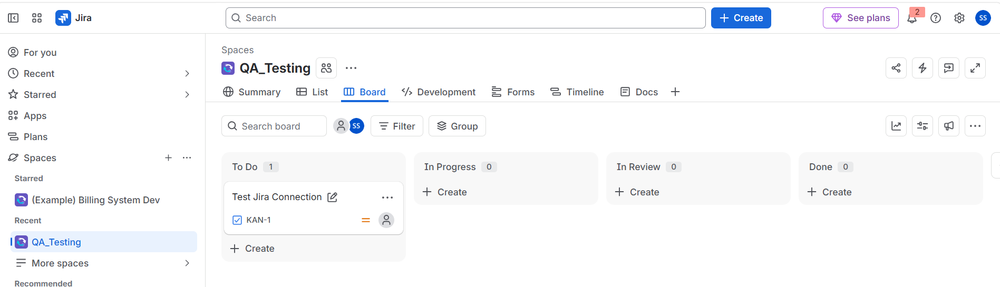
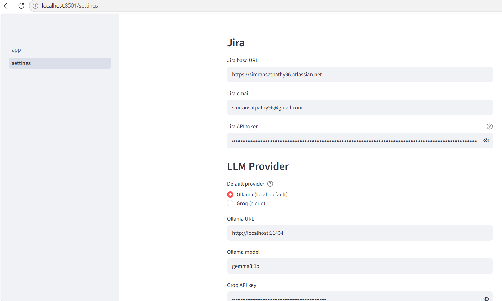
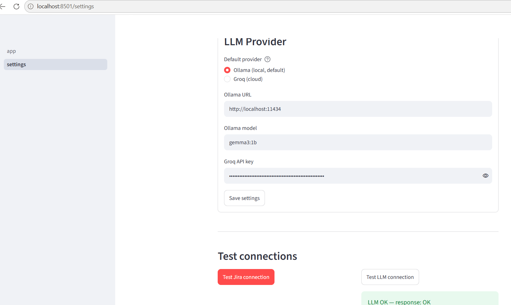

# Assignment 02 — Jira Local Test Case Generator

## Chapter 03 — Local LLMs

## 1. Project Overview

This project is a QA-focused **AI Test Case Generator** that retrieves requirements from Jira and uses a Large Language Model (LLM) to generate structured software test cases.

The application combines:

- **Jira REST API** — source of requirements
- **Ollama** — local LLM runtime
- **Gemma 3:1B** — local model used for generation
- **Streamlit** — web-based user interface
- **Prompt Engineering** — controlled test-case generation
- **Python** — application and integration logic

The primary workflow is:

```text
Jira Requirement
      ↓
Jira REST API
      ↓
Requirement Extraction
      ↓
Prompt Template
      ↓
Ollama / Gemma 3:1B
      ↓
Test Case Generation
      ↓
Streamlit UI
      ↓
QA Review
```

---

## 2. Assignment Objective

The objective of this assignment is to build a working application that can:

1. Connect to Jira using the Jira REST API.
2. Retrieve a Jira issue using its issue key.
3. Extract the ticket summary, description and acceptance criteria.
4. Use a local LLM through Ollama.
5. Generate a requested number of QA test cases.
6. Restrict generation to the supplied requirements.
7. Reduce hallucination through prompt constraints.
8. Return test cases in a consistent Markdown table format.
9. Display the generated test cases through a Streamlit interface.

---

## 3. Application Architecture

The application consists of the following major components:

```text
                         USER
                           │
                           ▼
                  ┌─────────────────┐
                  │   Streamlit UI  │
                  │     app.py      │
                  └────────┬────────┘
                           │
                           ▼
                  ┌─────────────────┐
                  │   Jira Client   │
                  │ jira_client.py  │
                  └────────┬────────┘
                           │
                           ▼
                  ┌─────────────────┐
                  │  Jira REST API  │
                  │   QA_Testing    │
                  │      KAN-1      │
                  └────────┬────────┘
                           │
                           ▼
                  ┌─────────────────┐
                  │   Requirements  │
                  │ Summary         │
                  │ Description     │
                  │ Acceptance      │
                  │ Criteria        │
                  └────────┬────────┘
                           │
                           ▼
                  ┌─────────────────┐
                  │ Prompt Template │
                  │ testcase_creator│
                  │      .md        │
                  └────────┬────────┘
                           │
                           ▼
                  ┌─────────────────┐
                  │   LLM Client    │
                  │ llm_client.py   │
                  └────────┬────────┘
                           │
                    ┌──────┴──────┐
                    ▼             ▼
               ┌─────────┐   ┌─────────┐
               │ Ollama  │   │  Groq   │
               │ Gemma   │   │Optional │
               │ 3:1B    │   │Provider │
               └────┬────┘   └────┬────┘
                    │             │
                    └──────┬──────┘
                           ▼
                  ┌─────────────────┐
                  │ Generated Test  │
                  │     Cases       │
                  └────────┬────────┘
                           ▼
                  ┌─────────────────┐
                  │ Streamlit Output│
                  │ Markdown Table  │
                  └─────────────────┘
```

A more detailed architecture is available in:

[`Artefacts/architecture/Architecture_Jira_Local_Test_Case_Generator.md`](Artefacts/architecture/Architecture_Jira_Local_Test_Case_Generator.md)

---

## 4. Technology Stack

| Technology | Purpose |
|---|---|
| Python | Application and integration logic |
| Streamlit | Web UI |
| Jira REST API | Retrieve Jira issue details |
| Ollama | Local LLM runtime |
| Gemma 3:1B | Local LLM used for generation |
| Groq | Optional alternative LLM provider |
| Requests | HTTP communication |
| Markdown | Prompt template and structured output |

---

## 5. Project Structure

```text
Assignment_02_Local_Test_Case_Generator/
│
├── Assets/
│   │
│   ├── src/
│   │   ├── .venv/
│   │   ├── __pycache__/
│   │   ├── pages/
│   │   ├── .env
│   │   ├── _e2e_test.py
│   │   ├── app.py
│   │   ├── Application_Screenshot
│   │   ├── config.py
│   │   ├── config_store.py
│   │   ├── Finetune_Prompt
│   │   ├── jira_client.py
│   │   ├── llm_client.py
│   │   └── plan
│   │
│   ├── requirements/
│   │
│   └── templates/
│       └── testcase_creator.md
│
├── Artefacts/
│   ├── screenshots/
│   │   ├── 01_jira_issue.png
│   │   ├── 02_jira_settings.png
│   │   ├── 03_ollama_settings.png
│   │   ├── 04_groq_settings.png
│   │   ├── 05_jira_connection_success.png
│   │   └── 06_streamlit_app_with_generated_TCs.png
│   │
│   └── architecture/
│       └── Architecture_Jira_Local_Test_Case_Generator.md
│
└── README.md
```

> `.venv/` and `__pycache__/` are local/generated directories and should not be committed to GitHub.

---

## 6. Jira Integration

The application retrieves Jira issue details through the Jira REST API.

The Jira client constructs the issue endpoint as:

```text
/rest/api/2/issue/{key}
```

The client returns the following information:

```text
{
    key,
    summary,
    description,
    acceptance_criteria
}
```

### Jira Project

The Jira project used during development is:

```text
QA_Testing
```

### Test Issue

The connection test uses:

```text
KAN-1
```

The issue was used to verify that the application can authenticate with Jira and retrieve ticket details.

### Error Handling

The Jira client handles:

- Missing Jira configuration
- Connection/request errors
- HTTP 401 — authentication failure
- HTTP 404 — ticket not found
- Other non-200 responses

---

## 7. Ollama / Local LLM

The primary LLM path uses Ollama running locally.

### Configuration

```text
Ollama URL:
http://localhost:11434

Model:
gemma3:1b
```

The local flow is:

```text
Streamlit
    ↓
Ollama API
    ↓
Gemma 3:1B
    ↓
Generated Test Cases
```

Using Ollama allows the application to use a locally running model instead of requiring a cloud LLM provider for the primary generation workflow.

---

## 8. Optional Groq Integration

The project also contains Groq integration as an alternative LLM provider.

The architecture therefore supports:

```text
Local path:
Application → Ollama → Gemma 3:1B

Alternative path:
Application → Groq API → Hosted LLM
```

The Groq API key is configuration data and must not be committed to the repository.

---

## 9. Prompt Engineering

The test-case generation behavior is controlled through:

```text
Assets/templates/testcase_creator.md
```

The prompt defines strict rules for the generated output.

### Role

The LLM is instructed to act as:

```text
Senior QA Engineer writing test cases.
```

### Output format

The generated response must contain exactly these columns:

```text
Test ID
Description
Pre-conditions
Steps
Expected Result
Priority
```

### Test ID format

```text
TC-001
TC-002
TC-003
...
```

### Priority

Only the following values are allowed:

```text
High
Medium
Low
```

### Anti-Hallucination Rules

The prompt instructs the LLM to:

- Use only the provided requirements.
- Avoid inventing features, fields or behaviors.
- Use `Not specified` when required information is missing.
- Generate distinct scenarios.
- Avoid duplicate test cases.
- Produce only the requested number of cases.
- Return only the Markdown table.

---

## 10. Test Case Generation Workflow

A typical user request is:

```text
Create 5 test cases for KAN-1
```

The application performs the following steps:

### Step 1 — Identify Jira issue

The application identifies:

```text
KAN-1
```

### Step 2 — Fetch Jira ticket

The Jira REST API returns the issue details.

### Step 3 — Extract requirements

The application extracts:

- Summary
- Description
- Acceptance Criteria

### Step 4 — Build the prompt

The Jira information is combined with the reusable test-case prompt template.

### Step 5 — Call the LLM

The assembled prompt is sent to the configured LLM.

### Step 6 — Generate test cases

The model generates the requested number of test cases.

### Step 7 — Render output

The generated Markdown is displayed by Streamlit as a formatted table.

---

## 11. Expected Output Format

The application is designed to generate output in this structure:

```markdown
| Test ID | Description | Pre-conditions | Steps | Expected Result | Priority |
|---|---|---|---|---|---|
| TC-001 | ... | ... | 1. ... 2. ... | ... | High |
| TC-002 | ... | ... | 1. ... 2. ... | ... | Medium |
```

The Markdown header and separator row are required so that Streamlit renders the result as a table.

---

## 12. Streamlit Application

The application runs locally using Streamlit.

### Local application URL

```text
http://localhost:8501
```

The localhost URL is expected because this project is designed as a local application.

The Streamlit interface provides:

- Chat-based interaction
- Jira issue processing
- Test-case generation
- Settings/configuration
- Generated test-case display

---

## 13. Application Evidence

Screenshots demonstrating the application are stored under:

```text
Artefacts/screenshots/
```

### 1. Jira Issue

The Jira issue used as the requirement source.



### 2. Jira Settings

The Streamlit Jira configuration.



### 3. Ollama Settings

The local Ollama configuration showing the local endpoint and configured model.



### 4. Successful Jira Connection

Evidence that the application successfully retrieves the Jira ticket.


### 5. Streamlit Application

The running Jira Test Case Generator interface.


### 6. Generated Test Cases

Evidence of the final structured test-case output.


---

## 14. Architecture Artefact

The detailed architecture documentation is available here:

[Architecture — Jira Local Test Case Generator](Artefacts/architecture/Architecture_Jira_Local_Test_Case_Generator.md)

It documents:

- High-level architecture
- Component responsibilities
- Jira integration flow
- Local LLM flow
- Prompt engineering flow
- Configuration flow
- End-to-end data flow

---

## 15. Configuration and Security

The application uses configuration values for Jira and LLM connectivity.

Sensitive values include:

- Jira API token
- Groq API key
- Other credentials

These values should remain local.

### Do not commit

```text
.env
.venv/
__pycache__/
```

The `.env` file must not be uploaded to GitHub.

If a secret is accidentally exposed or committed, it should be revoked/rotated immediately.

The README and screenshots should contain configuration **names and non-sensitive values only**, never actual API keys or tokens.

---

## 16. Validation Performed

### Jira Connection

An initial connection test used an invalid/non-existent issue:

```text
TEST-1
```

This returned:

```text
404 — Ticket TEST-1 not found
```

The test was corrected to use the actual Jira issue:

```text
KAN-1
```

The application then successfully retrieved the Jira ticket.

### LLM Configuration

The local LLM configuration was verified using:

```text
Ollama URL: http://localhost:11434
Model: gemma3:1b
```

### End-to-End Flow

The complete flow was validated as:

```text
Jira KAN-1
    ↓
Ticket retrieved
    ↓
Requirements extracted
    ↓
Prompt constructed
    ↓
Ollama / Gemma 3:1B
    ↓
Test cases generated
    ↓
Streamlit displays Markdown table
```

---

## 17. Formatting Fix

During development, generated rows could appear visually like table rows without being rendered as a proper Markdown table.

The prompt was therefore designed to explicitly require the Markdown header and separator:

```markdown
| Test ID | Description | Pre-conditions | Steps | Expected Result | Priority |
|---|---|---|---|---|---|
```

This ensures that the Streamlit Markdown renderer can interpret the generated content as a table.

---

## 18. Limitations

- `gemma3:1b` is a relatively small model and may require stronger prompting for complex requirements.
- LLM-generated test cases should still be reviewed by a QA engineer.
- The model may occasionally require regeneration if it does not follow the requested format.
- Jira access requires valid credentials and appropriate permissions.
- The local application is available only on the machine where it is running unless separately deployed.
- The current Jira connection test uses `KAN-1` as the known test issue.

---

## 19. Future Enhancements

Possible improvements include:

1. Make the Jira connection-test issue configurable.
2. Add automatic Markdown-table validation.
3. Add retry/regeneration when output formatting is invalid.
4. Export generated test cases to Excel or CSV.
5. Add requirement-to-test-case traceability.
6. Support additional Ollama models.
7. Add automated duplicate detection.
8. Add positive, negative, boundary and validation classifications.
9. Expand automated testing for Jira and LLM integrations.
10. Add CI/CD validation.

---

## 20. Running the Application

### Prerequisites

The local environment should have:

- Python
- Required Python packages
- Jira access
- Ollama installed and running
- `gemma3:1b` available locally

### Start Ollama

Ensure the local Ollama service is running and the configured model is available.

```text
Ollama URL: http://localhost:11434
Model: gemma3:1b
```

### Start Streamlit

From the application's source directory:

```bash
streamlit run app.py
```

The application should become available at:

```text
http://localhost:8501
```

---

## 21. Assignment Deliverables

The assignment contains the following deliverables:

- [x] Jira integration
- [x] Jira REST API client
- [x] Local LLM integration using Ollama
- [x] Gemma 3:1B configuration
- [x] Prompt template for test-case generation
- [x] Streamlit application
- [x] Structured Markdown test-case output
- [x] Application screenshots
- [x] Architecture documentation
- [x] README documentation
- [x] Jira connection validation
- [x] End-to-end generation flow

---

## 22. Key Learning Outcome

This assignment demonstrates how a QA engineer can combine traditional testing tools with generative AI.

Instead of manually copying requirements from Jira into an AI tool, the application automates the workflow:

```text
Jira
  ↓
REST API
  ↓
Requirement Extraction
  ↓
Prompt Engineering
  ↓
Local LLM
  ↓
Test Case Generation
  ↓
Structured QA Output
```

The main learning outcome is understanding how a **QA application can connect an external requirement-management system such as Jira to an LLM and produce controlled, requirement-driven test artifacts through a local AI workflow**.
