# Chapter 06: Branding and LinkedIn Skills

A Claude/Codex skill that turns any content seed into a publish-ready pack in
Pramod Dutta's Testing Academy voice. Drop in a title, a handful of rough
bullets, a screenshot, a URL, a thread, or a spoken brain dump. The skill
returns four files: a Medium article, a LinkedIn post, LinkedIn image prompts,
and a Medium cover prompt.

This is not a generic "write a post" prompt. It encodes the Hook / Story / Offer
spine, the word budgets, the banned phrases, the image specs, and the failure
modes observed in real sessions.

## Contents

- [The big picture](#the-big-picture)
- [What it produces](#what-it-produces)
- [File layout](#file-layout)
- [Install the skill](#install-the-skill)
- [How a pack is produced](#how-a-pack-is-produced)
  - [Seed shapes](#seed-shapes)
  - [Mining the seed](#mining-the-seed)
  - [Voice spine](#voice-spine)
  - [Offer ladder](#offer-ladder)
  - [Controversial hooks](#controversial-hooks)
  - [Closing sweep](#closing-sweep)
- [Worked example](#worked-example)
- [Thirteen content threads](#thirteen-content-threads)
- [Q&A](#qa)
- [Trigger phrases](#trigger-phrases)

## The big picture

A seed goes in. Four publish-ready files come out. A human still hits publish.

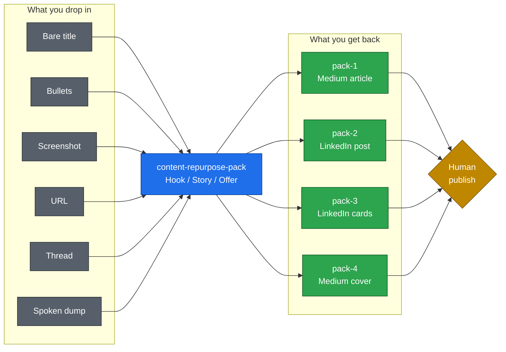

## What it produces

| File | Job |
| --- | --- |
| `pack-1-medium-article.md` | 2,500 to 3,200 word Medium draft, paste-ready Markdown |
| `pack-2-linkedin-post.md` | Hook ladder + 220 to 260 word post + first-comment blocks |
| `pack-3-linkedin-image-prompts.md` | Style C v2 tweet-screenshot cards (hook, mechanism, closer) |
| `pack-4-medium-image-prompt.md` | Style A 16:9 cyber infographic for the Medium cover |

If you ask for a single deliverable, it still ships as its own file. Deliverables
are never merged.

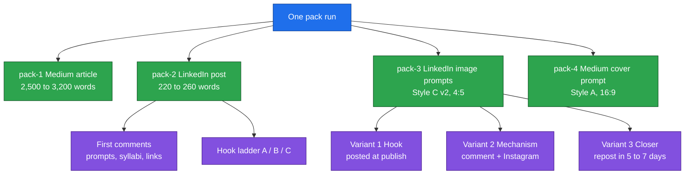

## File layout

```
chapter_06_Branding_LinkedinSkills/
├── README.md                         # this file
├── files.zip                         # original archive
├── content-repurpose-pack.skill      # packaged .skill bundle
└── content-repurpose-pack/           # installable skill folder
    ├── SKILL.md                      # pipeline, hook protocol, closing sweep
    └── references/
        ├── brand-voice.md            # identity, spine, 13 threads, signature lines
        ├── deliverable-specs.md      # exact formats for the four pack files
        └── worked-example.md         # one full input-to-output pass
```

`files.zip` holds the same materials as a flat archive plus the `.skill` bundle.
The folder is the copy to install: `SKILL.md` reads
`references/brand-voice.md`, not a sibling file.

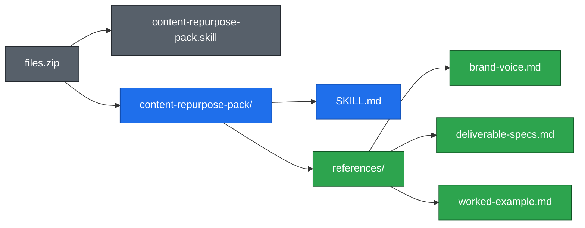

## Install the skill

Copy the folder only when the destination name is unused:

```bash
skill_source=chapter_06_Branding_LinkedinSkills/content-repurpose-pack
skill_destination="$HOME/.claude/skills/content-repurpose-pack"

if [ -e "$skill_destination" ]; then
  echo "Skill already exists; compare and back it up before an explicitly approved update."
  exit 1
fi

mkdir -p "$(dirname "$skill_destination")"
cp -R "$skill_source" "$skill_destination"
```

For Codex, point `skill_destination` at `$HOME/.codex/skills/content-repurpose-pack`
instead. Then invoke it by name, such as `$content-repurpose-pack`.

You can also drop `content-repurpose-pack.skill` into a client that accepts
packaged `.skill` files. It is a zip of the same folder.

## How a pack is produced

The skill runs in order. It re-reads the voice spec every time; an earlier draft
in the conversation does not substitute for it.

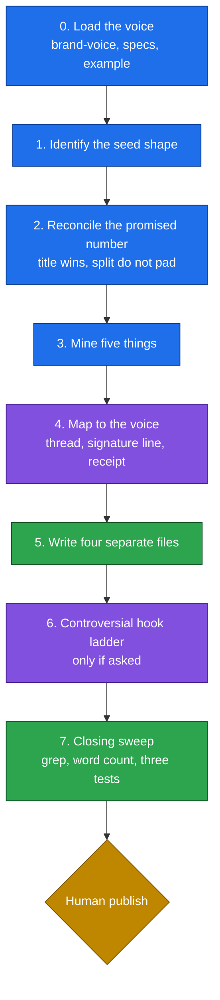

1. **Load the voice.** Read `brand-voice.md`, then the deliverable specs, then the
   worked example. Hard rule: no em dashes anywhere.
2. **Identify the seed.** Six shapes: bare title, bullets, screenshot, URL,
   thread/article, spoken brain dump. Each is handled differently.
3. **Reconcile the promised number.** If the title says "7 steps" and the bullets
   are 5, the title wins. Split compound bullets. Never pad with filler.
4. **Mine five things.** The transferable thesis, the framework, verbatim assets,
   numbers (owned vs verifiable vs source-only), and a discard pile of the
   original author's CTAs.
5. **Map to the voice.** Pick one of the 13 content threads, reuse a signature
   line if it fits, re-angle one example into QA/SDET, and find a receipt.
6. **Write the four files.** Templates live in `deliverable-specs.md`.
7. **Closing sweep.** Grep for em dashes and banned phrases, count words, then
   run the chai test, the BFSI CTO test, and the next-sprint test.

### Seed shapes

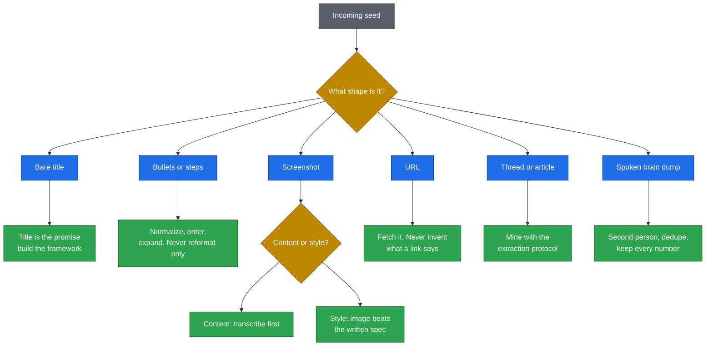

### Mining the seed

Pull exactly five things, in this order. Source-only stats are never stated as fact.

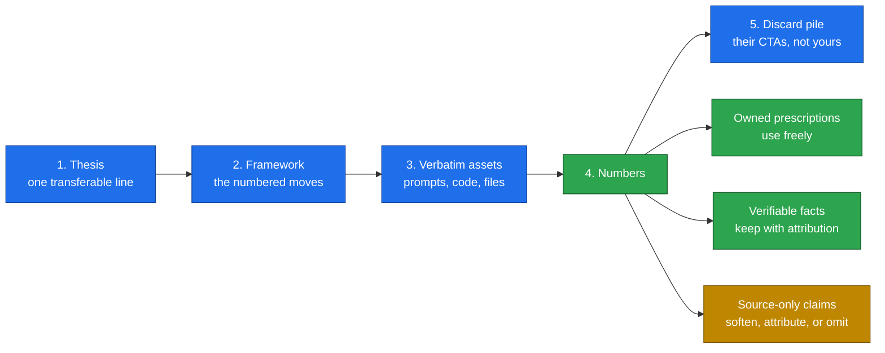

### Voice spine

Every LinkedIn post and every Medium article uses the same three beats. Only the
word budget changes.

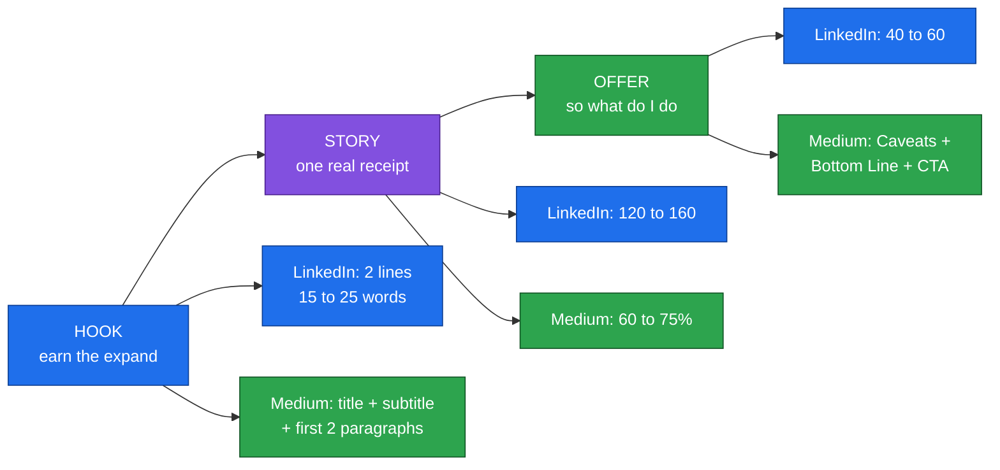

| Beat | Job | LinkedIn | Medium |
| --- | --- | --- | --- |
| Hook | Earn the expand. Create a gap. | 2 lines, 15 to 25 words | Title + bold subtitle + first 2 paragraphs |
| Story | Pay it off with one thing that happened | 120 to 160 words | 60 to 75% of the article |
| Offer | Convert attention into a next action | 40 to 60 words | Honest Caveats + Bottom Line + italic CTA |

LinkedIn total is 220 to 260 words. 280 is the hard ceiling. The usual miss is a
great Hook and Story with no Offer.

How a LinkedIn post is assembled, in order:

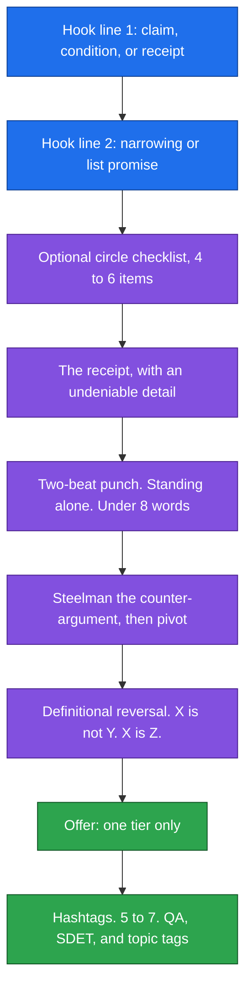

### Offer ladder

One tier per post. Rotate. Roughly four posts on Tier 1 or 2, then one on Tier 3.
Tier 4 only for actual launches.

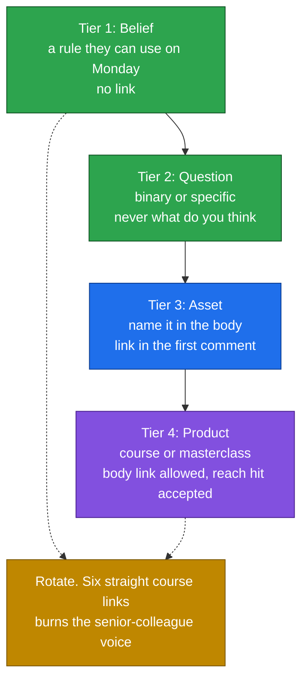

### Controversial hooks

When you ask for controversial, provocative, or bold hooks, the skill does not
refuse and does not sanitize. It returns a graded ladder:

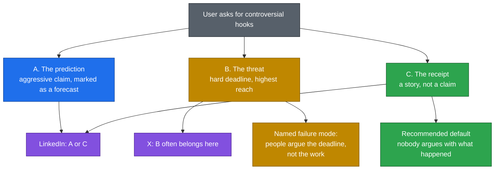

- **A. The prediction.** Aggressive claim, marked as a forecast, timing record
  admitted as imperfect.
- **B. The threat.** Closest to a hard deadline, highest reach, often fails the
  BFSI CTO test. Belongs on X more often than LinkedIn.
- **C. The receipt.** A story, not a claim. Recommended default for LinkedIn.

### Closing sweep

Run this on every file, every time. Use the shell, do not eyeball it.

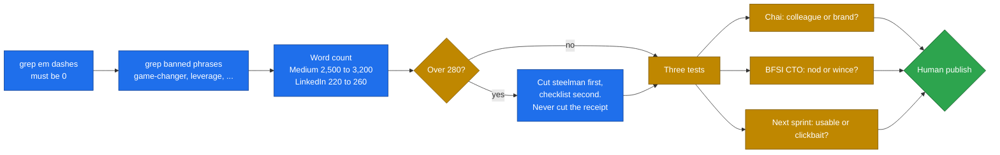

## Worked example

The bundled example starts from a dictated title ("7 step formula") plus five
rough third-person bullets about moving from manual QA into automation.

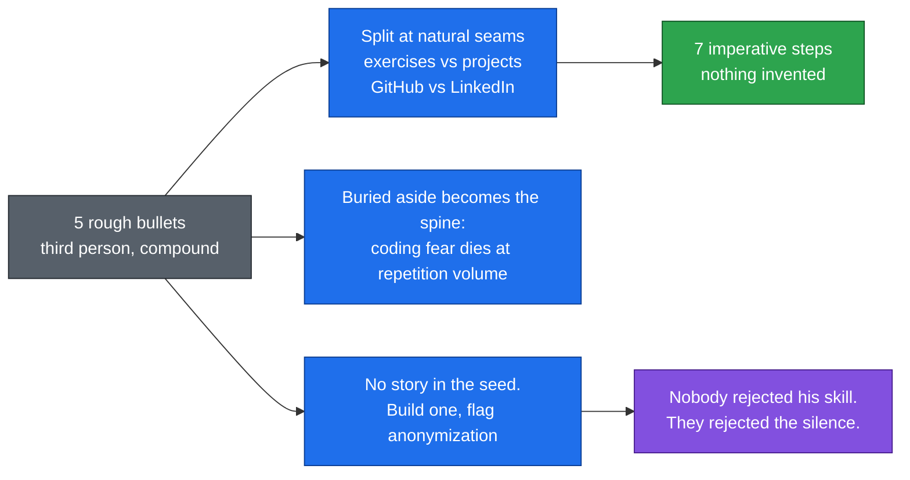

What the skill did:

- Expanded 5 bullets to 7 by splitting compound items (exercises vs projects,
  GitHub vs LinkedIn). Nothing invented.
- Converted third person to second person. Kept every number: 90 days, 300 to
  400 exercises, 10 a day, 1 hour, 5 projects.
- Pulled the real thesis out of a closing aside: coding fear is cured by
  repetition volume, not by understanding.
- Built a receipt the seed did not contain (four interviews dying at "send us
  your GitHub") and flagged anonymization in the verify block.
- Recommended hook C, assigned hook B to X, and reported a 292-to-270 word cut.

That gap between the input and the output is the gap the skill exists to close.

## Thirteen content threads

Every piece connects to at least one. Name the thread to yourself before writing.

```mermaid
flowchart TB
    ROOT["Name one thread before writing"]

    ROOT --> CAREER["Career"]
    ROOT --> AI["AI verification"]
    ROOT --> TOOLS["Tools and infra"]
    ROOT --> PATH["Path and workflow"]

    CAREER --> C1["1. The Math Doesn't Work"]
    CAREER --> C2["10. Career Stakes"]
    CAREER --> C3["12. Learning Path, 90 Days"]

    AI --> A1["2. AI Tests AI"]
    AI --> A2["3. Pattern Recognition"]
    AI --> A3["4. Quality Gates"]
    AI --> A4["5. Speed"]

    TOOLS --> I1["6. Infrastructure"]
    TOOLS --> I2["7. Stability"]
    TOOLS --> I3["8. Deep Debugging"]

    PATH --> P1["9. Migration, Selenium to Playwright"]
    PATH --> P2["11. Foundation repo"]
    PATH --> P3["13. Workflow, ICSR in practice"]

    classDef ai fill:#1f6feb,stroke:#0b3d91,color:#fff
    classDef pack fill:#8250df,stroke:#4a1f8f,color:#fff
    classDef out fill:#2da44e,stroke:#0f5323,color:#fff
    classDef src fill:#57606a,stroke:#24292f,color:#fff
    class ROOT src
    class CAREER,AI,TOOLS,PATH ai
    class C1,C2,C3,A1,A2,A3,A4 pack
    class I1,I2,I3,P1,P2,P3 out
```

## Q&A

- **Q: When do I reach for it?** A: Any time you have a seed (even a bare
  headline) and want a Medium + LinkedIn + image pack in this voice, not a
  generic rewrite.
- **Q: What does it replace?** A: Re-prompting from scratch for voice, length,
  image specs, and first-comment splits. Those rules already live in the skill.
- **Q: What's the gotcha?** A: A pack with no receipt is the biggest quality
  drop. If the seed has no real story, supply one or accept a composite flagged
  for anonymization. Also grep for em dashes before publishing; they sneak in.

## Trigger phrases

The skill is meant to fire on "write a LinkedIn post", "make a Medium article",
"repurpose this", "in my voice", "full pack", "give me hooks", and also when you
simply drop source material or a title with steps and expect content back.
It triggers even when only one deliverable is requested.
